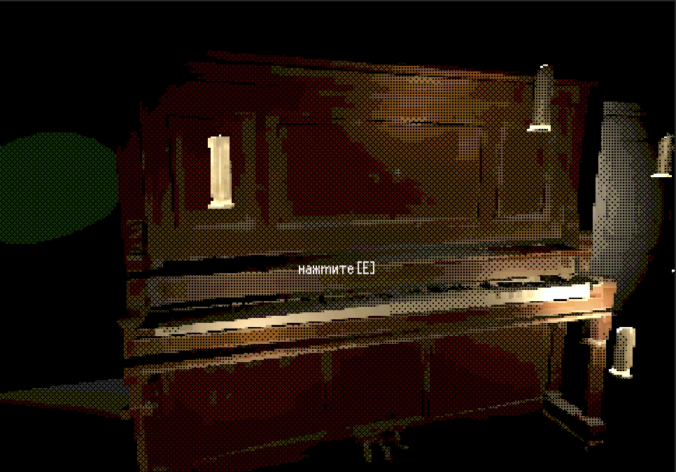

## [Доклад](Доклад.pdf)

## [Презентация](Презентация.pdf)

## Федеральное агентство по образованию РФ

## Дальневосточный федеральный университет

## Институт математики и компьютерных технологий
## Департамент информационных и компьютерных систем
## Отчёт о практическом задании по предмету Программная инженерия

# Хоррор-игра на Unity

### Федотов И. Н.
### Мельников С. В.
### Курышев В. И.
Б9121-09.03.03пикд

## Владивосток, 2023 г. 

# 1\. Введение

## 1.1 Глоссарий

Геймплей — компонент игры, отвечающий за взаимодействие игры и игрока. Геймплей описывает, как игрок взаимодействует с игровым миром, как игровой мир реагирует на действия игрока и как определяется набор действий, который предлагает игроку игра.

Игровой движок [1] — базовое программное обеспечение компьютерной игры. Разделение игры и игрового движка часто расплывчато, и не всегда студии проводят чёткую границу между ними. Но в общем случае термин «игровой движок» применяется для того программного обеспечения, которое пригодно для повторного использования и расширения, и тем самым может быть рассмотрено как основание для разработки множества различных игр без существенных изменений. 

Скример — внезапно появляющийся страшный кадр в фильмах ужасов, видеороликах, компьютерных играх и т. п., сопровождаемый пронзительным криком или другим пугающим звуком.

Туториал — пошаговая инструкция по выполнению какого-либо процесса, учебное пособие, познавательный обучающий материал

Prefab — представляет собой готовый шаблон объекта, который можно использовать для создания экземпляров в игровой сцене.

Raycast — некоторый луч, испускаемый из некоторого объекта в некотором направлении некоторой длины (либо бесконечный) для определения коллизий (столкновений) с объектами.

Unity [2] — кроссплатформенный игровой движок, разработанная американской компанией Unity Technologies.

Unreal Engine [3] — игровой движок, который был создан в 1998 году, компаний Epic Games.

## 1.2 Описание предметной области

Область компьютерных игр появилась достаточно давно, развивается по сей день и пользуется широкой популярностью.  Компьютерные игры созданы для развлечения, и широко используются в коммерческих целях, а в некоторых странах игры признаны как предмет искусства, что позволяет им конкурировать с кино. Компьютерные игры могут быть различными: многопользовательские игры, промо-игры, программы, созданные с целью привлечь потенциального покупателя. Компьютерные игры могут быть созданы большими компаниями с большими финансами (AAA-проекты) либо небольшим коллективом без финансовой поддержки (инди-проекты) и имеют несколько жанров. В рамках данной работы будет рассмотрено создание инди-проекта в жанре “хоррор”.

Инди-игры, или игры, созданные небольшими командами или отдельными разработчиками, имеют довольно долгую историю. Их начало можно отследить еще в 1980-х годах, когда многие игры были созданы людьми, работающими из дома и распространялись через дисководы компьютеров. Однако, настоящий бум инди-игр начался только в 2000-х годах. С развитием Интернета и распространением цифровых дистрибьюторов игр, таких как Steam, эти игры стали легко доступными для потребителей. В 2005 году был основан сайт Kongregate, который стал одним из первых платформ для распространения браузерных игр, созданных независимыми разработчиками. Одной из первых популярных игр на этой платформе была "Desktop Tower Defense", созданная в 2007 году. В 2008 году была выпущена игра "World of Goo", которая считается одной из первых инди-игр, которая добилась большого коммерческого успеха. Она была создана небольшой командой разработчиков из США и продана в количестве более 2 миллионов копий. В последующие годы индустрия инди-игр продолжала расти и развиваться. В 2010 году была выпущена игра "Minecraft", которая стала одной из самых успешных и популярных игр всех времен. Она была создана независимым разработчиком из Швеции и продана в количестве более 200 миллионов копий. В 2012 году была выпущена игра "Journey", которая получила множество наград и стала первой игрой, которая была признана "Лучшей игрой года" на церемонии BAFTA. В последующие годы индустрия инди-игр продолжала расти и демонстрировать огромный потенциал. Некоторые известные инди-игры, выпущенные в последние годы, включают в себя "Undertale", "Stardew Valley", "Celeste" и "Hollow Knight". 

Сегодня индустрия инди-игр является одной из самых динамичных и успешных в мире видеоигр. Благодаря технологическому прогрессу и увеличению количества цифровых платформ для распространения игр, инди-игры стали еще более доступными для разработчиков и игроков. В настоящее время многие из них создаются в различных жанрах и на разных платформах, включая мобильные устройства, консоли и ПК. Одним из факторов, способствующих росту индустрии инди-игр, является их относительно низкая стоимость разработки и производства. Благодаря этому, разработчики могут сосредоточиться на творческом процессе и создании уникального геймплея и идей, не привязываясь к бюджетам больших студий. Однако, как и в любой индустрии, в инди-секторе есть свои проблемы. Одной из них является конкуренция и перенасыщение рынка, которые могут затруднить продвижение новых игр. Также некоторые игроки могут быть скептически настроены к играм, созданным независимыми разработчиками, считая их менее качественными, чем игры от больших студий. В целом, индустрия инди-игр продолжает расти и развиваться, привлекая все больше и больше разработчиков и игроков. Она становится все более разнообразной и интересной, предлагая новые и оригинальные игровые концепции и идеи, которые могут найти свою аудиторию среди игроков по всему миру.

Одним из таких примеров послужил феномен инди-хорроров в стилистике игр для Playstation One в начале 2020 года. На одном из самых популярных онлайн-сервисов для размещения игр itch.io появился бандл игр под названием "Haunted PS1 Demo Disc", в который входило 15 хоррор игр. Этот бандл не только сильно понравился игрокам, но и вдохновил разработчиков так, что даже в конце 2021 половина загружаемых хорроров на itch.io это игры с графикой игр для Playstation One. [4]

## 1.3 Неформальная постановка задачи

В рамках данной работы необходимо разработать 3D компьютерную игру в жанре инди-хоррор в графическом стиле игр для Playstation One. Для этого требуется: разработать сценарий, найти проектное решение, в данном случае движок, и готовые ассеты или разработка своих, изучение движка.

Политика распространения открытая, исходный код игры  опубликован на GitHub, а сам билд игры на [itch.io](https://itch.io/) доступен бесплатно.

## 1.4 Обзор существующих методов решения

Критерии сравнения:
* Качество сюжета — этот критерий оценивает насколько хорошо разработан и реализован сюжет игры. Ключевые аспекты включают оригинальность и интригующую историю, хорошо разработанные персонажи с глубокими мотивами и увлекательные повороты сюжета. Игра с сильным сюжетом заставляет игрока интриговаться и хочется узнать, какая будет следующая глава или развязка истории
* Атмосфера и стиль — этот критерий оценивает создание уникальной и неповторимой атмосферы в игре. Важно, чтобы игра передавала подходящий стиль для хоррор-жанра, создавала мрачную обстановку.
* Продолжительность — этот критерий оценивает, сколько времени требуется для прохождения игры. Важно найти баланс между слишком короткой и слишком длинной игрой.
* Интересный геймплей — этот критерий оценивает, насколько увлекательным и интересным является геймплей в инди хоррор игре. Игра должна предложить разнообразные механики, головоломки. 
* Техническое исполнение —  этот критерий оценивает качество реализации игры с технической точки зрения. Игра должна быть стабильной, с минимальными багами и глюками, хорошей графикой и звуковыми эффектами. Техническое исполнение также включает оптимизацию игры, чтобы она работала плавно и без задержек на разных системах. Высокое качество технической реализации способствует погружению игрока и обеспечивает бесперебойное игровое впечатление.

Инди-хорроры в стиле Playstation One.
1. Cry of The Mermaid [5] — игра про заброшенный пассажирский корабль. Игра цепляет своей жуткой, меланхоличной атмосферой, интересными загадками и сюжетными записками. Время прохождения 30-45 минут.
2. The Touch [6] — игра про молодую женщину с ребенком, которая осталась с ним одна глубокой ночью. Игра пытается продлить время прохождения путем низкой скоростью передвижения и напугать игрока скримерами. Время прохождения 3-5 минут.
3. MOTH HOUSE [7] — игра, где нужно собирать большое количество мотыльков в очень темном заброшенном доме. Можно отметить очень интересную идею использования страха к насекомым, интересный визуальный стиль и техничность (реализован инвентарь, поимка мотыльков), но при этом отсутствует внятный сюжет, то есть игра сосредоточена на геймплее. Время прохождения 15-25 минут.
4. sleeping alone [8] — игра, повествующая о 7-летнем мальчике, который заметил в доме призрака, в последствии убившего его родителей. Игра создает напряженную атмосферу, использует довольно простую, но цепляющую историю, знакомая каждому, кто боялся в детстве призраков, при этом не используя никаких скримеров. Время прохождения 10-15 минут.
5. NIGHT OF CONSUMERS [9] — игра про работника супермаркета, который пытается выполнять свою работу, но ему всячески мешают посетители магазина. Сама игра не пытается запугать скримерами игрока, но, за счет атмосферы и стилистики, игра получилось страшной.

|          Игра          | Качественный сюжет | Атмосфера и стиль | Продолжительность (минут) | Интересный геймплей | Техническое исполнение |
|:----------------------:|:------------------:|:-----------------:|:-------------------------:|:-------------------:|:----------------------:|
|   Cry of The Mermaid   |          +         |         +         |           30-45           |          +          |           +-           |
|       MOTH HOUSE       |         +-         |         +         |           15-25           |          +          |            +           |
|     sleeping alone     |         +-         |         -         |           10-15           |          -          |           +-           |
|        The Touch       |          -         |         -         |            3-5            |          -          |            -           |
| NIGHT OF THE CONSUMERS |          -         |         +         |           15-30           |          +          |            +           |
|        MemoRISE        |          +         |         +         |            5-10           |          +          |            +           |

# 2\. Требования к окружению

## 2.1. Требования к аппаратному обеспечению

Понадобятся примерно следующие характеристики:
* ОС: Windows 7/8/10/11, MacOS, Linux
* Процессор: Любой 64-битный процессор
* Оперативная память: 4 ГБ ОЗУ
* Видеокарта: с поддержкой DirectX или OpenGL
* Место на диске: 90~ мб

## 2.2 Требования к пользователям

Основная целевая аудитория — люди, интересующиеся инди-играми, в особенности пользователи сайта [itch.io](https://itch.io/). В основном, это люди, имеющие минимальный игровой опыт и возрастом больше 12 лет.

### Игрок
Требования:
* возраст больше 12 лет
* минимальный игровой опыт, то есть пользователь без проблем может ориентироваться в игре, двигая мышкой и нажимая на клавиши.

# 3\. Спецификация данных

## Сущность — главный герой

Данная сущность представлена с помощью структуры данных Prefab. Она предназначена для хранения данных о персонаже, имплементации передвижения и взаимодействия с предметами. Перечислим некоторые атрибуты данной сущности:

* Скорость передвижения
* Подобран ли ключ от какой-либо сцены
* Читает ли записку
* Другие состояния сцен/главного героя.

Данные атрибуты можно было бы использовать для сохранения прогресса игрока, но так как игра рассчитана на краткое время прохождения, было принято решение отказаться от такой функции.

# 4\. Функциональные требования

## 4.1 Сценарий

Главный герой просыпается с амнезией в незнакомом для него доме. Он [дом] стоит в поле, полном пшеницы, и выглядит одиноко. Внутри этого дома нет ничего необычного, но в ходе его изучения оказывается, что в нем хранится секрет.

### Спальня — начальная комната, туториал

Спальня плохо освещена, поэтому игроку нужно будет взять фонарик, который будет находится на полке. Также на ней будет записка, которую можно будет прочитать:

___
` Ты проснулся в этом заброшенном доме и, возможно, не помнишь своего прошлого, но я знаю, что ты совершил грехи, которые нужно искупить. Ты бросил тех, кто тебе дорог, и оставил за собой путь разрушения. `

` Теперь тебе предстоит искупить свои грехи. Этот дом, в котором ты находишься, является символом твоих ошибок и темного прошлого. Тебе придется исследовать каждые его комнаты. `

` Не отчаивайся. Не все еще потеряно. Чтобы искупить свои грехи, ты должен разгадать загадку этого дома. `

` Помни, что прошлое не определяет тебя. Ты можешь изменить свою судьбу и стать лучшим человеком. Верь в себя и иди вперед. `
___

Главный герой, следуя записке, решает исследовать дом и найти места, где могут быть скрыты предметы. Но дверь из спальни оказывается закрытой, ключ от нее находится за картиной. Главный герой, найдя ключ, следует в зал.

### Зал

В комнате стоит фортепиано, освещенное мерцающими свечами, создавая призрачное освещение. Игроку придется разгадать музыкальную головоломку на фортепиано, чтобы выбраться из этого дома. Но для этого нужно будет сыграть правильную мелодию. Игрок должен исследовать дом для поиска правильных нот.

### Кухня 

Здесь главный герой осматривает и открывает предметы в комнате до тех пор, пока не найдет ключ от библиотеки в микроволновке.

### Библиотека

Игрок должен осмотреть комнату, пробегая взглядом по книжным полкам. Одна из книг активирует скрытый механизм, открывающий скрытый проход, который хранит в себе ноты для пианино. Теперь, получив ноты, главный герой направляется к пианино.

Также в этой комнате есть другие книги, с которыми можно взаимодействовать и прочитать:

Книга 1:

___
` Сегодня решил признаться самому себе в своем главном грехе – лени. Это не то, о чем гордо говорить всем вокруг, но я должен признать, что она овладела мной, и я не могу больше этого игнорировать. `

` Лень охватывает меня своим тяжелым одеялом, когда я должен сделать что-то важное или взяться за дела, которые требуют усилий и настойчивости. Я всегда нахожу оправдания и откладываю дела на потом, позволяя лени забрать свою долю времени и энергии. Я не могу себе представить, сколько возможностей и достижений я упустил из-за этого дурного привычки. `

` Она влияет на мое здоровье и самочувствие. Я пропускаю тренировки, откладываю заботу о своем здоровье и нередко позволяю себе углубляться в нездоровые привычки, такие как перекусы вредной едой и сидение перед экраном вместо активного времяпрепровождения. `

` Честно говоря, я чувствую себя виноватым и разочарованным из-за этого. Я знаю, что у меня есть потенциал и возможности, но моя лень становится препятствием на пути к достижению моих целей и мечтаний. `
___
Книга 2:

___
` Вижу себя, как я ставил себя на первое место, как я думал только о своих интересах и удовлетворении своих желаний, не обращая внимания на нужды и чувства других. Я вижу, как я был зациклен на своем собственном "я", как я стремился к славе, власти и материальным благам, не думая о том, как это влияет на окружающих. Почему я был таким эгоистичным и самолюбивым? Почему я не смог выходить за пределы своего "я" и заботиться о других? Чувство упрека и смирения охватывает меня, и я осознаю, что эгоизм и самолюбие - еще один грех, который мне нужно преодолеть. `
___

Книга 3:

___
` Я держал злобу в сердце, как я носил обиды и затаивал злопамятство, как я мстил и желал зла тем, кто меня обидел или оскорбил. Я вижу, как я губил мира и счастья других, изливая свою злобу и злопамятство на них. Почему я был таким злобным и злопамятным? Почему я не смог прощать и отпускать обиды, как Христос научил нас? Чувство раскаяния и нужды в прощении охватывает меня, и я осознаю, что злоба и злопамятство - еще один грех, который я должен покаяться и оставить позади. `
___

### Пинанио — конец

Главный герой решает головоломку с пианино, нажав правильную последовательность клавиш. Начинает играть успокаивающая мелодия, и главный герой появляется в поле, означающее прощение и умиротворение.

|  |
|:--:|
| *Рисунок 1 - Диаграмма состояний* |

## 4.2 Формулировка требований

Исходя из сценария, были сформулированы функциональные требования. Cистема должна позволять игроку:

* передвигать главного героя от первого лица
* взаимодействовать с предметами — открывать/закрывать, передвигать, подбирать их
* переходить между сценами
* читать записки/книги
* включать/выключать фонарик
* играть на виртуальном пианино.

Также, для удобства, система должна позволять игроку:

* менять разрешение экрана
* уровень громкости.

|  |
|:--:|
| *Рисунок 2 - Диаграмма прецедентов* |

# 5\. Требования к интерфейсу

Интерфейс должен:
* Интуитивно понятен игроку.
* Поддерживать русский язык.
* Оптимизирован для большинства разрешений экрана с соотношением 16:10, 16:9 и 4:3.
* Интегрирован в игру как можно более органично, чтобы не отвлекать игрока от игрового процесса.
* Позволять игроку настраивать разрешение экрана, звук и другие параметры игры, чтобы создать максимально комфортные условия для игры.
* Обучать управлению персонажем.

# 6\. Проект

## 6.1 Средства реализации

Unity и Unreal Engine - два из наиболее популярных игровых движков на рынке. Оба движка предоставляют мощные инструменты для создания игр и имеют свои особенности. 

| Название      | ЯП  | Цена      | Скорость разработки | Сложность изучения |
|---------------|-----|-----------|---------------------|--------------------|
| Unity         | C#  | Бесплатно | Быстрая             | Средняя            |
| Unreal Engine | C++ | Бесплатно | Средняя             | Сложная            |

Оба Unity и Unreal Engine являются мощными инструментами для создания игр. Движок Unity выбран в следствии того, что Unity имеет более простой и интуитивный интерфейс, что было важно для скорости разработки проекта. 

## 6.2 Структуры данных

Так как Unity использует язык C#, он имеет все те же структуры данных, используемые в C#, такие как: массивы, списки, словари и прочее. Они были использованы в скриптах, к примеру: хранить все объекты клавиш пианино, хранить все звуки клавиш пианино и так далее.

Структурой данных в Unity можно и назвать Prefab. В данном случае Prefab был использован для персонажа игры, который будет содержать все необходимые компоненты и свойства, чтобы персонаж мог функционировать и взаимодействовать с окружающей средой.

## 6.3 Модули и алгоритмы

Общая структура системы представляет из себя набор классов на языке C#:

* PlayerScript — реализует перемещение игрока между сценами, его состояние и окружающего мира
* FirstPersonController — реализует передвижение игрока
* Interactor — реализует проверку того, смотрит ли игрок на объект и является ли он интерактивным, используя RayCast.
* Objects — реализуют взаимодействия с объектами (анимация, подбор предметов)
* UI - реализуют все функции интерфейса (субтитры, затемнение, записки, главное меню, настройки)
* PianoScene — реализует головоломку с пианино.

## 6.4 Проект интерфейса

Был реализован и описан проект интерфейса.

## 6.4.1 Главное меню

|  |
| :--:|
|*Рисунок 3 - Главное меню*|

Приведен интерфейс главного меню:
* играть — переходит к начальной сцене
* настройки — переходит к сцене настроек
* выйти — выходит из игры.

## 6.4.2 Субтитры

|  |
|:--:|
|*Рисунок 4 - Субтитры*|

Приведен интерфейс субтитров реплик персонажа. В данном случае главный герой реагирует на закрытую дверь в начальной сцене.

## 6.4.3 Взаимодействие с предметами

|  |
|:--:|
|*Рисунок 5 - Взаимодействие с пианино*|

Приведен интерфейс взаимодействия с предметами. При нажатии кнопки [E] происходит взаимодействие с предметом, к примеру:
* перейти на сцену
* открыть предмет
* передвинуть предмет
* подобрать предмет
* прочитать записку.

## 6.4.5 Записки

|  |
|:--:|
|*Рисунок 6 - Записка*|

Приведен интерфейс записок. В игре их всего 4 и описаны в 4.1 Сценарий.

# Список литературы

1. https://ru.wikipedia.org/wiki/%D0%98%D0%B3%D1%80%D0%BE%D0%B2%D0%BE%D0%B9_%D0%B4%D0%B2%D0%B8%D0%B6%D0%BE%D0%BA

2. https://docs.unrealengine.com/5.2/en-US/

3. https://docs.unrealengine.com/5.2/en-US/

4. https://dtf.ru/indie/937127-fenomen-indi-horrorov-v-stile-ps1

5. https://ks98.itch.io/cry-of-the-mermaid

6. https://krieghor.itch.io/the-touch

7. https://kenforest.itch.io/moth-house

8. https://simvlz.itch.io/sleeping-alone

9. https://germfood.itch.io/nightoftheconsumers